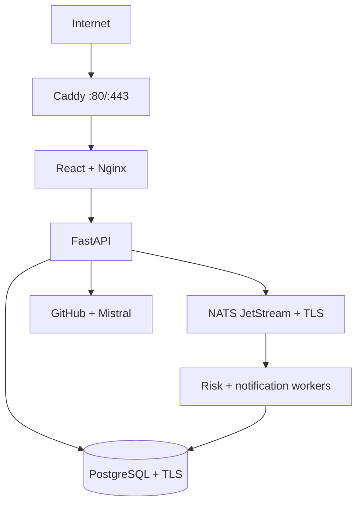

# Bantam on one cloud VM

This bundle runs Bantam as a small, single-host production deployment. It is
sized for the synthetic banking demo, roughly ten concurrent users, and one
repository-graph/Mistral attack-tree generation at a time. It is not highly
available and does not turn Bantam into a real banking platform. The directory
keeps its historical `digitalocean` name, but the Compose bundle is
cloud-neutral and is supported on a GCP Compute Engine VM or a DigitalOcean
Droplet.

## Topology

Only Caddy publishes host ports. Caddy terminates public HTTPS and explicitly
replaces inbound `X-Forwarded-For` and `X-Forwarded-Proto` values. The
production Nginx container preserves that sanitized metadata for the API,
whose trusted-proxy CIDR contains only the private app network. Caddy is
restricted to HTTP/1.1 and HTTP/2, so the stack does not advertise unreachable
HTTP/3 while UDP 443 remains closed.



PostgreSQL, NATS, Nginx, and the API have no published host ports. The API is
the only application container on the outbound network, so workers and data
services cannot call the internet. Persistent Docker volumes hold PostgreSQL,
JetStream, and Caddy certificate state.

## VM and network prerequisites

Use Ubuntu 24.04 with an SSH key and at least 2 vCPU, 4 GiB RAM, and a 30–50 GiB
disk when images will be built on the host. A GCP Compute Engine `e2-medium` is
the recommended evaluation size. Long-lived container limits total 1,664 MiB,
leaving enough memory for the host, Docker, and a bounded Vite build. A 1 vCPU,
2 GiB VM is viable only with prebuilt images and swap. Enable provider
monitoring and scheduled VM snapshots in addition to database-aware backups.

Create GCP VPC firewall rules (or the equivalent provider firewall) with only
these inbound rules:

| Protocol | Port | Source |
|---|---:|---|
| TCP | 22 | Your fixed IP or trusted VPN only |
| TCP | 80 | All IPv4 and IPv6 |
| TCP | 443 | All IPv4 and IPv6 |

Do not allow host ports 3000, 4222, 5432, 8080, or 8222. The host needs
outbound DNS, HTTP, and HTTPS for image pulls, ACME, GitHub, and Mistral.

Create an `A` record for the permanent Bantam hostname pointing to the
VM's reserved public IPv4 address before starting Caddy. Add an `AAAA` record only
if IPv6 is configured and reachable.

Install Docker Engine from Docker's official Ubuntu repository, including the
Compose plugin. On a 2 GiB host, add 2 GiB of swap if `swapon --show` reports no
existing swap:

```bash
sudo fallocate -l 2G /swapfile
sudo chmod 600 /swapfile
sudo mkswap /swapfile
sudo swapon /swapfile
echo '/swapfile none swap sw 0 0' | sudo tee -a /etc/fstab
```

## First deployment

Clone the repository into a root-controlled deployment directory and prepare
the environment. `prepare.sh` refuses to overwrite an existing deployment
identity. It generates independent signing keys, database/NATS credentials, a
Fernet key, a private internal CA, and hostname-bound PostgreSQL/NATS server
certificates.

```bash
sudo mkdir -p /opt/bantam
sudo chown "$(id -u):$(id -g)" /opt/bantam
git clone --depth 1 https://github.com/aam57689/bank.git /opt/bantam/app
cd /opt/bantam/app
chmod +x \
  deploy/digitalocean/prepare.sh \
  deploy/digitalocean/backup-postgres.sh \
  deploy/digitalocean/validate-deployment.sh
./deploy/digitalocean/prepare.sh \
  bantam.example.com \
  operator@example.com \
  super-admin@example.com
```

The optional third argument writes `BANTAM_SUPER_ADMIN_EMAIL`; that matching
`BANK_ADMIN` account bypasses scoped admin RBAC and can create other scoped
administrators. The generated `deploy/digitalocean/production.env` is mode
`0600` and ignored by Git. Back it up securely; losing the signing, MFA, or
JetStream keys can invalidate sessions or make encrypted state unreadable.


### Supply prebuilt images

The generated environment initially names local images. Prefer building on a
workstation or in CI, publishing both images to a registry, and replacing these
three values with an immutable release identifier and digest-pinned references:

```text
BANTAM_IMAGE_TAG=<reviewed-git-commit>
BANTAM_API_IMAGE=ghcr.io/example/bantam-api@sha256:<digest>
BANTAM_WEB_IMAGE=ghcr.io/example/bantam-web@sha256:<digest>
```

Authenticate the VM to the registry with a read-only pull credential, then
pull and validate the resolved stack:

```bash
docker compose \
  --env-file deploy/digitalocean/production.env \
  -f deploy/digitalocean/compose.yml pull
./deploy/digitalocean/validate-deployment.sh \
  deploy/digitalocean/production.env
```

Without a registry, build on another Linux/amd64 machine using the same local
tags, transfer the result with `docker save`, and load it on the VM with
`docker load`. An `e2-medium` has enough memory to build locally; run the
following command:

```bash
docker compose \
  --env-file deploy/digitalocean/production.env \
  -f deploy/digitalocean/compose.yml build
```

### Migrate and bootstrap

Start the data services and run migrations as a finite command before creating
the first administrator:

```bash
docker compose \
  --env-file deploy/digitalocean/production.env \
  -f deploy/digitalocean/compose.yml up -d postgres nats

docker compose \
  --env-file deploy/digitalocean/production.env \
  -f deploy/digitalocean/compose.yml run --rm migrate
```

The long-lived API and workers also depend on the one-shot `migrate` service
completing successfully. A later `up -d` therefore cannot silently start them
against a known-unmigrated database if this explicit command was skipped.

Create the first bank administrator without writing its password into the env
file or shell history. The command is idempotent and never resets an existing
administrator:

```bash
read -rp 'Bank admin email: ' BANK_ADMIN_BOOTSTRAP_EMAIL
read -rsp 'Bank admin password: ' BANK_ADMIN_BOOTSTRAP_PASSWORD; echo
export BANK_ADMIN_BOOTSTRAP_EMAIL BANK_ADMIN_BOOTSTRAP_PASSWORD
docker compose \
  --env-file deploy/digitalocean/production.env \
  -f deploy/digitalocean/compose.yml run --rm \
  -e BANK_ADMIN_BOOTSTRAP_EMAIL -e BANK_ADMIN_BOOTSTRAP_PASSWORD \
  bantam-api bootstrap-bank-admin
unset BANK_ADMIN_BOOTSTRAP_EMAIL BANK_ADMIN_BOOTSTRAP_PASSWORD
```

Use `bootstrap-aspis-admin` with `ASPIS_ADMIN_BOOTSTRAP_EMAIL` and
`ASPIS_ADMIN_BOOTSTRAP_PASSWORD` if a separate Aspis administrator is needed.
Administrators must enrol MFA at their first login.

Start the complete stack:

```bash
docker compose \
  --env-file deploy/digitalocean/production.env \
  -f deploy/digitalocean/compose.yml up -d
```

Verify both the container state and public path:

```bash
docker compose \
  --env-file deploy/digitalocean/production.env \
  -f deploy/digitalocean/compose.yml ps

curl --fail --show-error --silent https://bantam.example.com/healthz
```

If HTTPS is not ready, confirm DNS first, then inspect Caddy and API logs:

```bash
docker compose \
  --env-file deploy/digitalocean/production.env \
  -f deploy/digitalocean/compose.yml logs --tail=200 caddy bantam-api
```

## Backups

Create a PostgreSQL custom-format dump:

```bash
./deploy/digitalocean/backup-postgres.sh
```

The script writes a mode-protected dump and SHA-256 file under
`deploy/digitalocean/runtime/backups` and removes only matching Bantam dumps
older than `BACKUP_RETENTION_DAYS` (14 days by default). Install the included
systemd timer for a daily backup with a randomized start time. The supplied
unit assumes the documented `/opt/bantam/app` checkout path:

```bash
sudo install -m 0644 deploy/digitalocean/systemd/bantam-backup.service \
  /etc/systemd/system/bantam-backup.service
sudo install -m 0644 deploy/digitalocean/systemd/bantam-backup.timer \
  /etc/systemd/system/bantam-backup.timer
sudo systemctl daemon-reload
sudo systemctl enable --now bantam-backup.timer
systemctl list-timers bantam-backup.timer
```

Edit the service before installing it if the repository lives elsewhere. Copy
backups off the VM and test restores periodically. Also back up these items
together:

- `deploy/digitalocean/production.env`
- `deploy/digitalocean/runtime/tls/ca`
- PostgreSQL dumps
- the `nats-data` volume if retaining queued event state matters

Provider snapshots are useful disaster recovery, but they do not replace a
database-aware dump.

## Internal certificate rotation

The internal CA is valid for ten years and PostgreSQL/NATS leaf certificates
for 825 days. Rotate leaf certificates at least yearly while retaining the
current CA:

```bash
./deploy/digitalocean/prepare.sh --rotate-certs
docker compose \
  --env-file deploy/digitalocean/production.env \
  -f deploy/digitalocean/compose.yml up -d --force-recreate
```

Use `--rotate-ca` instead when replacing the trust root. Both modes stage and
verify a complete certificate set before atomically switching the runtime
directory. They retain the prior set as `runtime/tls.previous.<rotation-id>` for
rollback; remove that copy only after the recreated stack and a database backup
have been verified.

## Updating Bantam

Take a backup, fetch a reviewed commit, select its reviewed image references,
and recreate the services. The migration dependency gates API and worker
startup:

```bash
./deploy/digitalocean/backup-postgres.sh
git pull --ff-only
docker compose \
  --env-file deploy/digitalocean/production.env \
  -f deploy/digitalocean/compose.yml pull
docker compose \
  --env-file deploy/digitalocean/production.env \
  -f deploy/digitalocean/compose.yml up -d --remove-orphans
```

Set `BANTAM_IMAGE_TAG` to the deployed Git commit SHA before a release if you
want the local image names and Aspis evidence metadata to identify that exact
revision.

## Security and operating limits

- `APP_ENV=production`; API docs, demo OTP disclosure, demo seed, startup
  migrations, and live ASVS probes are disabled.
- The production web build contains neither the deterministic Codespaces
  password nor the seeded profile email addresses. Its login form starts empty;
  the profile shortcuts remain available only through the Vite development
  server.
- Public TLS is managed by Caddy. Internal database and event-bus connections
  verify a private CA and the service DNS name.
- PostgreSQL rejects non-TLS bridge connections and uses SCRAM authentication.
  NATS requires TLS and a generated credential, and encrypts JetStream data at
  rest with a separate generated key. JetStream file storage is capped at 1
  GiB so a runaway producer cannot consume the VM's entire disk.
- PostgreSQL's Unix-socket rule remains `local all all trust` for its in-container
  health check and backup command. Anyone able to `docker exec` into that
  container already has VM-root-equivalent control; do not grant Docker
  access to application users.
- Caddy drops every Linux capability except `NET_BIND_SERVICE`. Nginx retains
  only `CHOWN`, `SETGID`, and `SETUID`, which its root master needs to prepare
  runtime paths and drop privileges to workers.
- The production env file is still visible to the host's root/Docker
  administrators. A single VM has no meaningful security boundary from
  its root operator; keep SSH and Docker access tightly restricted.
- JSON logs rotate at 10 MiB with three files per service. Send them to remote
  storage if audit retention matters.
- Docker restart policies detect worker crashes, but the workers do not yet
  publish application-level heartbeats; alert on outbox age and notification
  freshness if worker-stall detection matters.
- This is one failure domain: a VM outage stops the web, API, workers,
  database, and event bus. Move PostgreSQL to a managed service and publish
  immutable images before treating availability as a requirement.

Relevant upstream guidance: [Docker on Ubuntu](https://docs.docker.com/engine/install/ubuntu/),
[Compose in production](https://docs.docker.com/compose/how-tos/production/),
[Caddy automatic HTTPS](https://caddyserver.com/docs/automatic-https),
[PostgreSQL TLS](https://www.postgresql.org/docs/current/ssl-tcp.html), and
[NATS encryption](https://docs.nats.io/learn/security/encryption).
